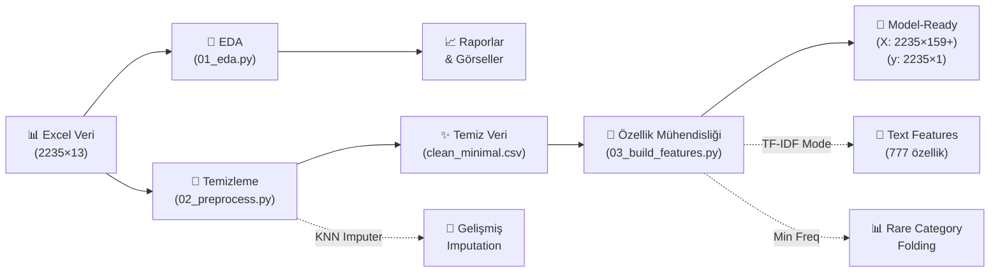
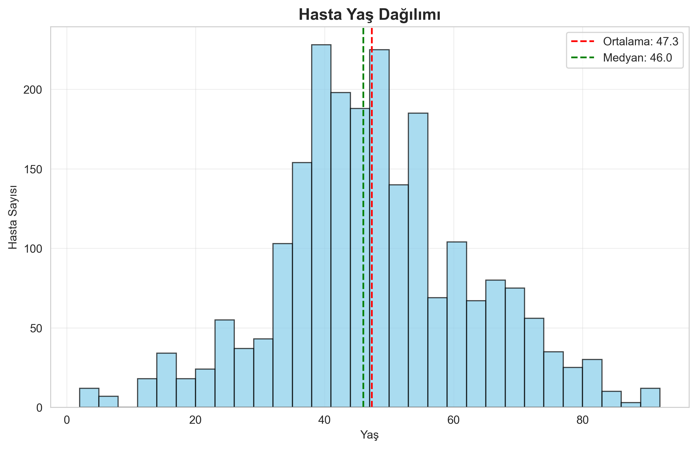
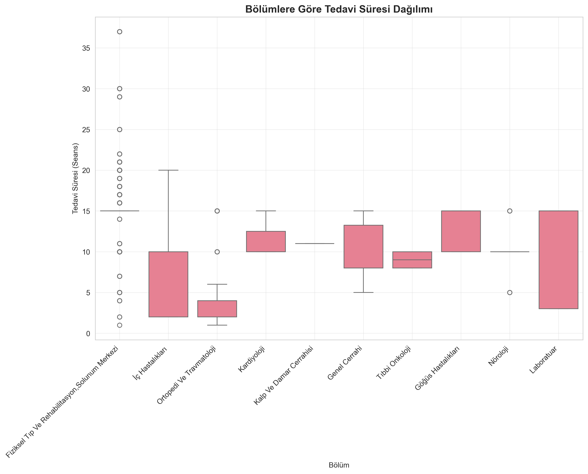

# Pusula Case Study

**Ad Soyad:** Halit Mert Artun  
**E-posta:** halitmertartun@outlook.com  


## 📋 Proje Özeti

Bu proje, 2235 satır × 13 sütunluk fiziksel tıp ve rehabilitasyon verisini analiz ederek model-ready özellik matrisi oluşturmayı amaçlamaktadır. Hedef değişken olarak tedavi süresi (seans sayısı) kullanılmaktadır.

⚠️ **Not:** Bu case study'de model kurmak zorunlu değildir; bu repo veriyi model-ready hâle getirmek için hazırlanmıştır.

### 🎯 Temel Özellikler
- **Kapsamlı EDA**: Eksik değer analizi, görselleştirmeler, kategorik analiz
- **Akıllı Veri Dönüşümleri**: Süreler sayısallaştırıldı, çoklu değerli alanlar işlendi
- **Model-Ready Çıktı**: X_model_ready.csv ve y.csv dosyaları
- **Türkçe Raporlar**: Tüm çıktılar Türkçe etiketlerle
- **Hata Yönetimi**: Kullanıcı dostu hata mesajları

## 🔄 Veri İşleme Pipeline'ı



## 🗂️ Veri Sözlüğü

| Sütun | Açıklama | Tip | Örnek Değerler |
|-------|----------|-----|---------------|
| **HastaNo** | Hasta kimlik numarası | ID | 1, 2, 3... |
| **Yas** | Hasta yaşı (yıl) | Sayısal | 25, 45, 67 |
| **Cinsiyet** | Hasta cinsiyeti | Kategorik | Kadın, Erkek |
| **KanGrubu** | Kan grubu bilgisi | Kategorik | A Rh+, 0 Rh-, AB Rh+ |
| **TedaviSuresi** | **🎯 HEDEF:** Tedavi süresi | Sayısal | "15 Seans" → 15 |
| **Tanilar** | Hastalık tanıları | Çoklu değerli | "DORSALJİ, Lumbalji" |

> **💡 Not:** Toplam 13 sütun, 2235 hasta. Çoklu değerli alanlar virgülle ayrılmış (ör: "Diabetes, Hipertansiyon").

## 📁 Proje Yapısı

```
Pusula_HalitMert_Artun/
├── data/
│   ├── Talent_Academy_Case_DT_2025.xlsx    # Ham veri
│   └── processed/                          # İşlenmiş veriler
│       ├── clean_minimal.csv
│       ├── model_ready_minimal.csv
│       ├── X_model_ready.csv              # 🎯 Özellik matrisi
│       └── y.csv                          # 🎯 Hedef değişken
├── reports/
│   ├── eda_summary.md                     # EDA özet raporu
│   ├── missing_summary.csv               # Eksik değer analizi
│   ├── categorical_unique_counts.csv      # Kategorik analiz
│   ├── top20_*.csv                        # En sık görülen öğeler
│   └── figures/                           # Görselleştirmeler
│       ├── hist_yas.png
│       ├── hist_tedavi_seans.png
│       ├── hist_uygulama_dk.png
│       └── box_tedavi_by_bolum.png
├── src/
│   ├── utils.py                           # Yardımcı fonksiyonlar
│   ├── 01_eda.py                          # Keşifsel veri analizi
│   ├── 02_preprocess.py                   # Veri temizleme
│   └── 03_build_features.py               # Özellik mühendisliği
├── requirements.txt                       # Python bağımlılıkları
└── README.md                             # Bu dosya
```

## 🚀 Hızlı Başlangıç

### 1. Kurulum
```bash
# Repository'yi klonla
git clone https://github.com/MertArtun/Pusula_HalitMert_Artun.git
cd Pusula_HalitMert_Artun

# Sanal ortam oluştur
python -m venv .venv
source .venv/bin/activate  # Windows: .venv\Scripts\activate

# Bağımlılıkları yükle
pip install -r requirements.txt
```

### 2. Veri Dosyasını Hazırla
`Talent_Academy_Case_DT_2025.xlsx` dosyasını `data/` klasörüne yerleştirin.

### 3. Analizi Çalıştır

#### Adım 1: Keşifsel Veri Analizi (EDA)
```bash
python src/01_eda.py --excel-path data/Talent_Academy_Case_DT_2025.xlsx --sheet Sheet1
```
**Çıktılar:** `reports/` klasöründe EDA raporları ve görseller

#### Adım 2: Veri Temizleme
```bash
python src/02_preprocess.py --excel-path data/Talent_Academy_Case_DT_2025.xlsx --sheet Sheet1
```
**Çıktılar:** `data/processed/` klasöründe temizlenmiş veriler

#### Adım 3: Özellik Mühendisliği
```bash
python src/03_build_features.py --input-csv data/processed/clean_minimal.csv --top_k 50
```
**Çıktılar:** Model-ready `X_model_ready.csv` ve `y.csv` dosyaları

### 🤖 Opsiyonel Model Eğitimi

Model-ready veriler oluşturulduktan sonra, isteğe bağlı olarak makine öğrenmesi modeli eğitebilirsiniz:

```python
import pandas as pd
from sklearn.ensemble import RandomForestRegressor
from sklearn.model_selection import train_test_split
from sklearn.metrics import mean_squared_error, r2_score

# Veriyi yükle
X = pd.read_csv('data/processed/X_model_ready.csv')
y = pd.read_csv('data/processed/y.csv')['TedaviSuresi_num']

# Train-test split
X_train, X_test, y_train, y_test = train_test_split(X, y, test_size=0.2, random_state=42)

# Model eğit
model = RandomForestRegressor(n_estimators=100, random_state=42)
model.fit(X_train, y_train)

# Tahmin ve değerlendirme
y_pred = model.predict(X_test)
print(f"R² Score: {r2_score(y_test, y_pred):.3f}")
print(f"RMSE: {mean_squared_error(y_test, y_pred, squared=False):.2f} seans")
```

## 🔧 Veri Dönüşüm Özellikleri

### Temel Dönüşümler
- ✅ **TedaviSuresi** → **TedaviSuresi_num** (hedef değişken)
- ✅ **UygulamaSuresi** → **UygulamaSuresi_dk** (dakika cinsinden)
- ✅ **Çoklu değerli alanlar** → **sayı kolonları** + **top-K binary özellikler**

### İşleme Stratejileri
- ✅ **Sayısal eksik değerler**: Median imputation
- ✅ **Kategorik eksik değerler**: "Bilinmiyor" ile doldurma
- ✅ **One-Hot Encoding**: Tüm kategorik değişkenler
- ✅ **Standardizasyon**: Sayısal özellikler için
- ✅ **Çoklu Etiket**: Binary özellik matrisi (ML_* prefix)

## 📊 Örnek Sonuçlar

### EDA Bulgular
- **En çok eksik değer**: Alerji (%42), Kan Grubu (%30)
- **En sık kronik hastalık**: Aritmi (395 hasta)
- **En sık tanı**: DORSALJİ (695 hasta)
- **En sık uygulama yeri**: Bel (543 hasta)

### 📈 Veri Görselleştirmeleri

#### Hasta Yaş Dağılımı
<div align="center">
  
  <p><em>Yaş dağılımı: Ortalama ~45 yaş, normal dağılım benzeri</em></p>
</div>

#### Bölümlere Göre Tedavi Süresi
<div align="center">
  
  <p><em>Tedavi süreleri bölümlere göre değişiklik gösteriyor</em></p>
</div>

### Özellik Matrisi
- **Boyut**: 2235 örnek × değişken özellik sayısı
- **Özellik Tipleri**: Sayısal, kategorik (one-hot), çoklu etiket (binary)
- **Hedef**: Tedavi süresi (seans sayısı)
- **Not**: Özellik sayısı seçilen moda göre değişir (varsayılan ML-binary ≈ 374; --min_freq azaltır; --text_mode tfidf artırır)

## 📈 Görselleştirmeler

| Grafik | Açıklama |
|--------|----------|
| `hist_yas.png` | Hasta yaş dağılımı |
| `hist_tedavi_seans.png` | Tedavi süresi dağılımı |
| `hist_uygulama_dk.png` | Uygulama süresi dağılımı |
| `box_tedavi_by_bolum.png` | Bölümlere göre tedavi süresi |

## 💡 Kullanım İpuçları

### Farklı Sheet'ler için
```bash
python src/01_eda.py --excel-path data/veri.xlsx --sheet "Veri_Sayfası"
```

### Farklı Top-K değerleri için
```bash
python src/03_build_features.py --input-csv data/processed/clean_minimal.csv --top_k 30
```

### 🚀 Gelişmiş Seçenekler

#### 1. KNN Imputation (Daha Akıllı Eksik Değer Doldurma)
```bash
# K-nearest neighbors ile sayısal eksik değer doldurma
python src/02_preprocess.py --excel-path data/Talent_Academy_Case_DT_2025.xlsx --sheet Sheet1 --imputer knn
```
**Avantaj:** Median'dan daha sophistike, benzer hastaların değerlerini kullanır.

#### 2. Nadir Kategori Birleştirme (Gürültü Azaltma)
```bash
# 20'den az görülen kategorileri "Diger" altında topla
python src/03_build_features.py --input-csv data/processed/clean_minimal.csv --top_k 50 --min_freq 20
```
**Sonuç:** 159 → 139 özellik (% 12.6 azalma), daha temiz model.

#### 3. TF-IDF Text Features (Gelişmiş Metin Analizi)
```bash
# Tanılar sütunu için TF-IDF n-gram özellikleri
python src/03_build_features.py --input-csv data/processed/clean_minimal.csv --text_mode tfidf
```
**Sonuç:** 159 → 777 özellik (sparse matrix), daha zengin metin temsili.

### Yardım almak için
```bash
python src/01_eda.py --help
python src/02_preprocess.py --help
python src/03_build_features.py --help
```

## 🔧 Teknik Detaylar

- **Python Sürümü**: 3.8+
- **Ana Kütüphaneler**: pandas, numpy, scikit-learn, matplotlib, seaborn
- **Veri Formatı**: Excel (.xlsx) girdi, CSV çıktı
- **Kod Standardı**: PEP8 uyumlu, docstring'ler ile açıklanmış

## 📝 Önemli Notlar

1. **Veri Dosyası**: `data/Talent_Academy_Case_DT_2025.xlsx` dosyasını manuel eklemeniz gerekmektedir.
2. **Hedef Değişken**: Eksik değerli satırlar model-ready veri setinden çıkarılır.
3. **Tekrarlanabilirlik**: Tüm random işlemler sabit seed kullanır.
4. **Bellek Kullanımı**: Büyük veri setleri için chunk processing önerilir.

## 🆘 Sorun Giderme

| Hata | Çözüm |
|------|-------|
| "Excel dosyası bulunamadı" | `data/` klasörüne doğru dosyayı koyun |
| "Sheet bulunamadı" | Excel dosyasındaki sheet adını kontrol edin |
| "Modül bulunamadı" | `pip install -r requirements.txt` |
| "tabulate eksik" | `pip install tabulate` |

## 📞 İletişim

Herhangi bir sorun veya soru için:
- **E-posta**: halitmertartun@outlook.com
- **GitHub Issues**: Bu repository'de issue açabilirsiniz

## 📄 Lisans

Bu proje MIT lisansı altında lisanslanmıştır.

---

*Bu proje Fiziksel Tıp & Rehabilitasyon veri analizi kapsamında geliştirilmiştir.*